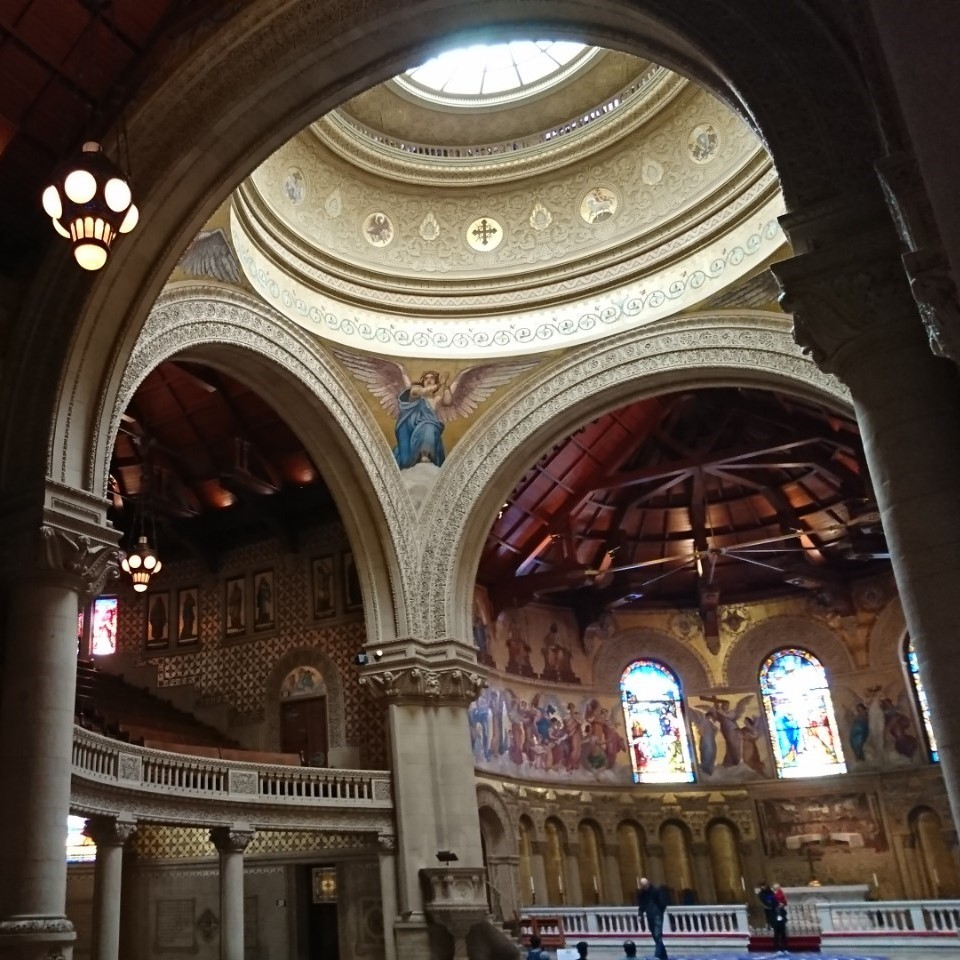

<!--
headingDivider: 2
-->

<!--
class: slides
-->

# 3分クッキング: DNS

<!--
_class: title
-->

### @hijiki51

#  @hijiki51

<!--
_class: user
-->

- 理学院物理学系3年
- SysAd班 リーダー
- 来年落とした必修を回収しないといけない

## 作るもの

## 材料
- Bind9導入済みサーバー二台
  - ISCが開発しているDNSサーバー
  - DNSに必要なすべての機能を網羅している

- Ubuntuサーバー二台

## 材料準備
- Docker Composeで準備する
- Docker NerworkでのIPアドレスを固定
  - Aレコードで使うため
  - ~~コンテナ名で名前解決すればいいとかいってはいけない~~

## 材料準備

出来上がったものがこちらになります

https://github.com/hijiki51/3-min-dns/blob/main/compose.yaml

## 親サーバーの設定

- ゾーンの設定
  - せっかくなのでオリジナルのTLDを使います
- RRの設定
  - SOAレコード
  - 子サーバーのNS,Aレコード、グルーレコード
  - server1のAレコード

## 親サーバーの設定
ゾーン設定：https://github.com/hijiki51/3-min-dns/blob/main/root/local
RR設定：https://github.com/hijiki51/3-min-dns/blob/main/root/hijiki51

## 子サーバーの設定
- ゾーンの設定
  - `sub.hijiki51`のサブドメインを移譲します
- RRの設定
  - 親サーバーと同様に

ゾーン設定：https://github.com/hijiki51/3-min-dns/blob/main/sub/local
RR設定：https://github.com/hijiki51/3-min-dns/blob/main/sub/sub

# 実演
